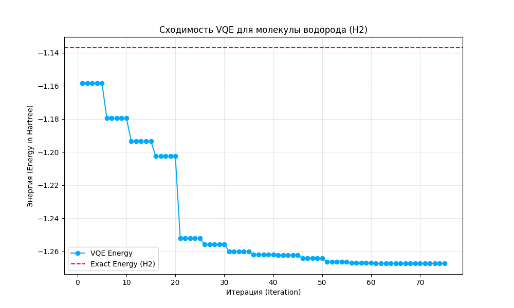

# Привет, я Andrey! 👋
### Квантовый инженер & Physics Enthusiast

- 🔬 Изучаю: Квантовые вычисления и квантовую оптику.
- 🛠 Стек: Python (Qiskit, PennyLane), C++, LaTeX.
- 🎯 Цель: Оптимизация вариационных квантовых алгоритмов (VQE).

---
### Мои квантовые проекты:
# Variational Quantum Eigensolver (VQE) для поиска энергии основного состояния молекул


## 📌 Обзор проекта
Этот репозиторий содержит реализацию алгоритма **VQE** для нахождения минимального собственного значения гамильтониана молекулы водорода ($H_2$). Проект демонстрирует гибридный квантово-классический подход, где квантовый процессор готовит состояние, а классический оптимизатор подбирает параметры.

## 🔬 Математическое обоснование
Алгоритм основан на вариационном принципе:
$$E_0 \le \langle \psi(\theta) | H | \psi(\theta) \rangle$$

Где:
- $H$ — Гамильтониан молекулярной системы.
- $|\psi(\theta)\rangle$ — Параметризованный анзац (Trial state).
- $\theta$ — Вектор классических параметров, минимизирующих энергию.

## 🛠 Технологический стек
- **Квантовый фреймворк:** Qiskit (Nature, Runtime).
- **Анзац:** `RealAmplitudes` и `EfficientSU2` для сравнения глубины цепи.
- **Оптимизаторы:** COBYLA (для симуляций без шума) и SPSA (для учета квантового шума).
- **Визуализация:** Matplotlib для графиков сходимости.

## 📊 Основные результаты
В ходе исследования были получены следующие данные:
1. **Точность:** Отклонение от точного решения (Exact Solver) составило менее $10^{-3}$ Хартри.
2. **Устойчивость к шуму:** Проведено сравнение работы алгоритма на симуляторе `AER` и с моделью шума процессора `ibm_brisbane`.

### График сходимости (Convergence Plot)


## 🚀 Как запустить
1. Клонируйте репозиторий:
   ```bash
   git clone https://github.com
